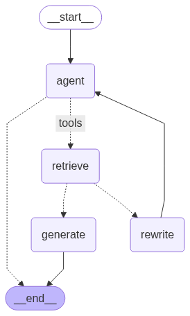

# 🤖 Agentic RAG with LangGraph & Groq LLM

An **Agentic Retrieval-Augmented Generation (RAG)** system built using **LangGraph, LangChain, FAISS, HuggingFace Embeddings, and Groq’s LLaMA-3.3 & 3.1 LLMs**.  

This project demonstrates how to combine **multi-step agent reasoning, retrieval tools, and query rewriting** into a single workflow that can **dynamically decide when to retrieve, rewrite, or generate answers** — a next-gen intelligent retrieval system.

## 🚀 Project Overview
Traditional RAG pipelines retrieve documents and generate answers directly. However, they often fail if the retrieved documents are irrelevant or if the query is poorly phrased.

This project enhances the traditional RAG pipeline by making it **agentic** – that means it can **think, decide, and adapt** at every step. Instead of just blindly retrieving and generating, the workflow is **dynamic and self-correcting**.

## Here’s how it works:
1. **Agent (Decision Maker)**  
   - The agent receives the user’s query.  
   - It decides whether the query needs additional context (retrieval) or if it can be answered directly.  

2. **Retriever (Knowledge Seeker)**  
   - If retrieval is needed, the agent calls specialized retrievers (vector stores).  
   - Two retriever tools are used:  
     - **LangGraph tutorials retriever**  
     - **LangChain tutorials retriever**  

3. **Relevance Grader (Quality Inspector)**  
   - Every retrieved document is **evaluated for relevance** using a **binary yes/no scoring system**.  
   - The grader acts like a filter:  
     - ✅ If documents are **relevant**, the process moves forward.  
     - ❌ If documents are **irrelevant**, the system does not waste time — it triggers query refinement.  

4. **Rewriter (Query Improver)**  
   - When documents don’t match well, the query is **rewritten intelligently**.  
   - The goal is to capture the **semantic intent** behind the user’s question, not just the literal words.  
   - The refined query is then sent back to the Agent, creating a feedback loop.  

5. **Generator (Answer Creator)**  
   - Once relevant documents are confirmed, the generator combines them with the query to **produce a final, well-grounded answer**.  
   - The generator is powered by **Groq’s LLaMA-3.3 70B model**, while lightweight tasks (grading & rewriting) are handled by **Groq’s LLaMA-3.1 8B model** for speed and efficiency.  

This way, the system mimics how a **human researcher** thinks: *ask → search → validate → refine → answer*.

## 🔄 Self-Correcting Feedback Loop
Unlike static RAG, this workflow is **iterative and adaptive**.  
If the first attempt fails, it doesn’t just give up or hallucinate. Instead, it:
- **Checks relevance**  
- **Rewrites the query if needed**  
- **Re-queries the retriever**  
- **Repeats until a strong answer is produced**  

This process mimics how a **skilled human researcher** operates:
1. Ask a question  
2. Search for information  
3. Judge the quality of results  
4. Refine the question if needed  
5. Formulate a reliable answer 

By integrating **decision-making, validation, and refinement** into the RAG pipeline, this project delivers:  
- **Higher accuracy** → Answers are based on relevant documents only.  
- **Robustness** → Poorly phrased queries are auto-corrected.  
- **Human-like reasoning** → The system actively learns and adapts during the conversation.  

In short, **Agentic RAG transforms a passive retrieval system into an intelligent, autonomous assistant**.

## 🏗️ Architecture & Workflow

## Flowchart:

    A [User Query]     --> B[Agent]

    B --> Use Tool     --> C[Retriever]
    
    B --> No Tool      --> G[End]
    
    C --> D[Relevance Grader]
    
    D --> Relevant     --> E[Generate Answer]
    
    D --> Not Relevant --> F[Rewrite Query]
    
    F --> B
    
    E --> G[End]

**Key Nodes:**
- **Agent** → Decides whether to retrieve or not.  
- **Retriever** → Fetches documents from FAISS vector stores (LangGraph + LangChain tutorials).  
- **Relevance Grader** → Validates if docs are useful with binary scoring.  
- **Rewriter** → Reframes poor queries.  
- **Generator** → Produces the final answer using Groq LLaMA-3.3 70B, assisted by Groq LLaMA-3.1 8B for lightweight tasks.  

## 🔑 Key Features
- ⚡ Multi-Agent Reasoning: Agent can decide when to use tools or finish.
- 📚 Two Knowledge Sources (retrievers):
  - LangGraph tutorials
  - LangChain tutorials
- 🧠 Intelligent Grading: Checks document relevance with yes/no binary scoring.
- 🔄 Self-Correcting: Automatically rewrites poor queries.
- 🚀 Powered by Groq LLMs:
  - `llama-3.3-70b-versatile` for generation
  - `llama-3.1-8b-instant` for rewriting & grading
- 🔍 FAISS + HuggingFace MiniLM embeddings for semantic retrieval.
- 🗂️ LangChain Hub prompts (`rlm/rag-prompt`) for flexible RAG generation.

## 🛠️ Tech Stack
- LangGraph → Workflow orchestration for agentic RAG.
- LangChain → Tools, retrievers, and utilities.
- Groq LLMs → Large (70B) for final answers, Small (8B) for rewrite/grading.
- FAISS → Vector database for similarity search.
- HuggingFace Sentence Transformers (all-MiniLM-L6-v2) via `langchain_huggingface` → Embeddings.
- dotenv → Environment variable management.
- Python → Core implementation.

## 🔑 Setup
1. Clone the repo.  
2. Install dependencies (`pip install -r requirements.txt`) or (`uv add -r requirements.txt`) 
   - Prefer once checking the project.toml file also for exact dependencies.
3. Create a `.env` file and add your API key:  
   - GROQ_API_KEY=your_api_key_here

## The agent will:
- Retrieve relevant docs
- Grade them
- Rewrite if needed
- Finally generate an answer.

## 💡 Why This Project Matters:
This project showcases the ability to design next-gen AI pipelines that go beyond simple RAG. 
By combining multi-agent workflows, query rewriting, and validation, it demonstrates strong skills in:

- AI Agent Orchestration
- LLM Tool Integration
- Vector Search & Semantic Retrieval
- Production-Ready RAG Design

## Run the pipeline:
- result = graph.invoke({"messages": [HumanMessage(content="What is LangChain?")]})
- print(result["messages"][-1].content)

## Output:

- ---CALL AGENT---
Agent model initialized and tools bound.

Agent generated a response.
- ---CHECK RELEVANCE---

Running relevance check with retrieved documents...
- ---DECISION: DOCS RELEVANT---

- ---CALL AGENT---
Agent model initialized and tools bound.
Agent generated a response.
- ---CHECK RELEVANCE---

Running relevance check with retrieved documents...
- ---DECISION: DOCS RELEVANT---

Agent generated a response.
- ---CHECK RELEVANCE---

Running relevance check with retrieved documents...

- ---DECISION: DOCS RELEVANT---
Running relevance check with retrieved documents...

- ---DECISION: DOCS RELEVANT---
- ---GENERATE---
Generating final response from retrieved documents...
Response generated successfully.

LangChain is a framework for building applications powered by large language models. It provides a set of tools and libraries to help developers create AI-powered interfaces and workflows. I don't have more specific information about LangChain beyond this general description.

#### ---END---